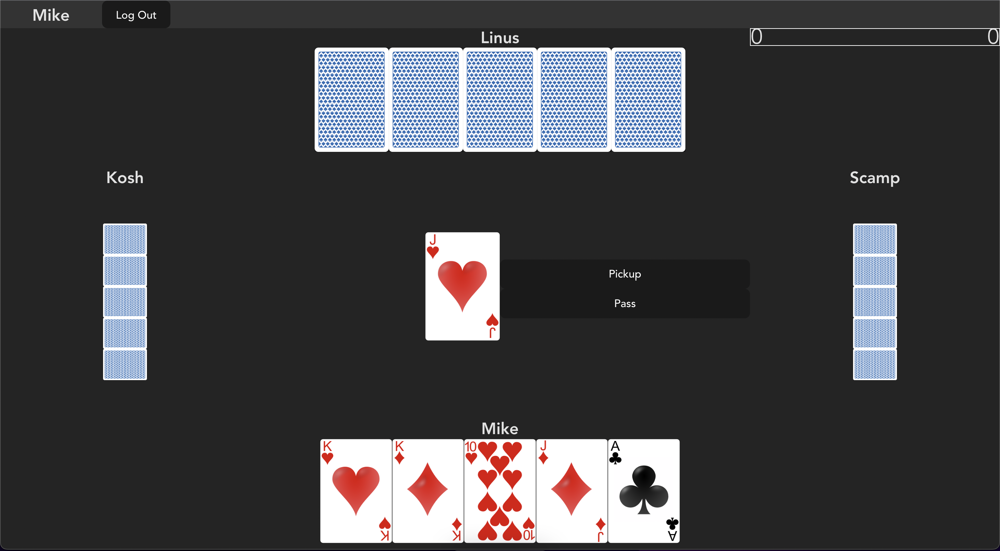

# Euchre Online

A simple multiplayer online euchre app.

Play at https://euchre.kutz.dev/



## Local Build
For test setup, i.e running all services in docker containers on a local
machine
```bash
docker compose build --build-arg DOTENV_FILE=.env.test
docker compose up
```

For local setup, i.e running each service locally directly on machine, each
service can be started manually, following directions in each directory.

